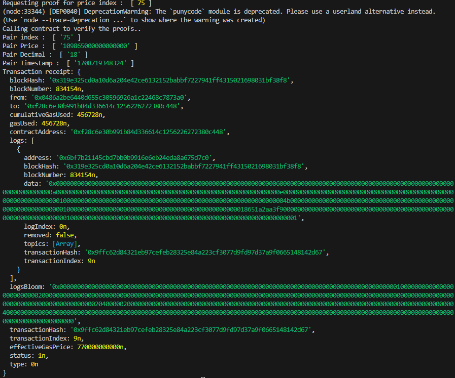

# Try this Example on Your Broswer with GitPod

1. Go to [this link](https://gitpod.io/#https://github.com/ed-marquez/PullOracleWalkthrough)

2. Run the following commands on the terminal:

   `cd client` `npm init --y` `npm install`

3. Rename the file `.env.SAMPLE` to `.env` and enter you Hedera network credentials (testnet/mainnet):

   `cp .env.SAMPLE .env`

4. Run the `main.js` script:

   `node main.js`

   You should see a console output similar to:
   
